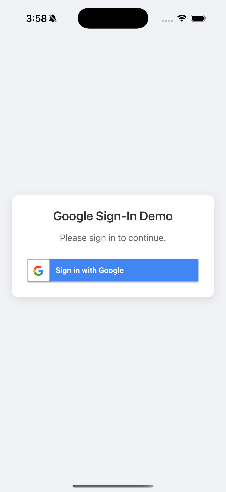

# ✅ React Native Google Sign-In (Android + iOS) - 2025

A **fully working, up-to-date implementation** of Google Sign-In in React Native for both **Android and iOS** platforms.

> Save 3–4 weeks of struggle! This one-stop solution is based on my own experience of scraping through outdated blogs, broken guides, and confusing documentation.

---

## 📸 Preview




---

## 🚀 Features

- ✅ Google Sign-In on both Android & iOS
- ✅ React Native CLI (not Expo, but easy to adapt)
- ✅ Firebase Authentication integration (optional)
- ✅ Clean and minimal UI
- ✅ Fully tested in 2025 React Native version

---

## 🛠️ Tech Stack

- React Native
- Google Sign-In SDK
- Firebase Auth (optional)
- Android & iOS native integration
- JavaScript / TypeScript ready

---

## 📦 Installation & Setup

### 1. Clone this repo
```bash
git clone https://github.com/your-username/react-native-google-signin-android-ios-working-2025.git
cd react-native-google-signin-android-ios-working-2025
