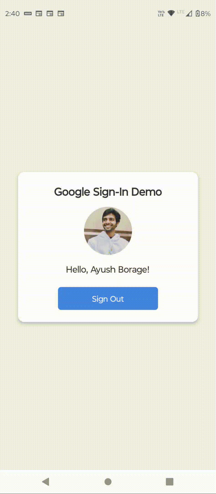
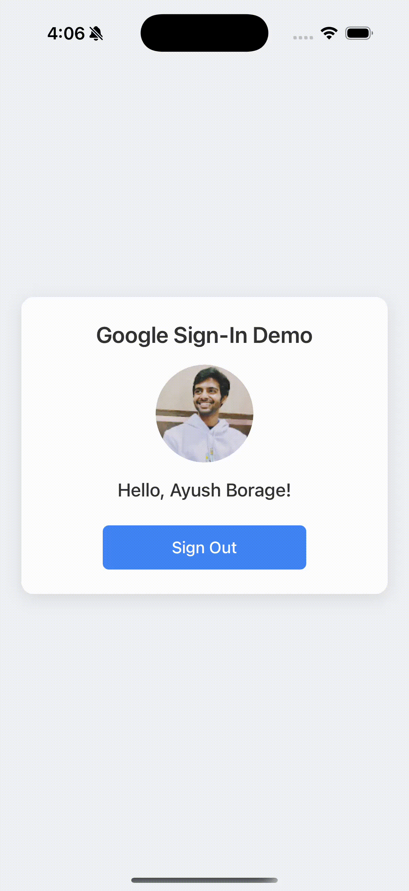

# 🚀 Google Sign-In Integration in Expo React Native (Bare Workflow)

This project demonstrates how to integrate **Google Sign-In** in a **React Native Expo (bare workflow)** project using the `@react-native-google-signin/google-signin` package with support for both **Android** and **iOS**.

---

## 📹 Demo

<p align="center">
  
  &nbsp;&nbsp;&nbsp;
  
</p>

---

## 📦 Package Used

```js
import { GoogleSignin } from "@react-native-google-signin/google-signin";
````

---

## 🧱 Project Setup

1. Create a new Expo project:

   ```bash
   npx create-expo-app MyGoogleAuthApp
   cd MyGoogleAuthApp
   ```

2. Install dependencies:

   ```bash
   npm install @react-native-google-signin/google-signin
   npm install expo-dev-client
   ```

3. Update `app.json` with plugin config:

   ```json
   {
     "expo": {
       "plugins": [
         [
           "@react-native-google-signin/google-signin",
           {
             "iosUrlScheme": "com.googleusercontent.apps.YOUR_IOS_CLIENT_ID"
           }
         ]
       ]
     }
   }
   ```

4. Prebuild the project:

   ```bash
   npx expo prebuild
   ```

---

## 🧪 Testing with Dev Client

### Android (Physical Device)

```bash
eas build --profile development --platform android
npx expo start --dev-client
```

> `npx expo run:android` requires Android Studio installed and won’t work out-of-the-box in this setup.

---

### iOS (Simulator or Device)

```bash
npx expo start --dev-client
```

> Press `i` to open the iOS simulator.
> `npx expo run:ios` works only if you have Xcode installed.

---

## 🔐 Google Sign-In Configuration

```js
GoogleSignin.configure({
  webClientId: "YOUR_WEB_CLIENT_ID.apps.googleusercontent.com", // client ID of type WEB for your server. Required to get the `idToken` on the user object, and for offline access.
  offlineAccess: true, // if you want to access Google API on behalf of the user FROM YOUR SERVER
  scopes: ['https://www.googleapis.com/auth/drive.readonly'], // what API you want to access on behalf of the user, default is email and profile
});
```

---

## 💻 Google Cloud Console Setup

1. Go to [Google Cloud Console](https://console.cloud.google.com/)
2. Set up **OAuth consent screen** → Select user type: **External**
3. Create OAuth 2.0 credentials:

### ✅ Web Client

* **Authorized JavaScript origins:**

  * `https://auth.expo.io` (example)

* **Authorized Redirect URIs:**

  * `https://auth.expo.io/@your-username.your-app-name` (example)

### ✅ Android Client

* Add package name + SHA1 fingerprint (`eas credentials`)

### ✅ iOS Client

* Use your **bundle ID** to create a new iOS OAuth client.
* Download and place the `GoogleService-Info.plist` in the `ios` directory.

---

## 🔑 Why Both Client IDs?

Google issues separate client credentials for **Web** and **Native** (Android/iOS) apps:

* Web clients enable **redirect-based flows** and allow token exchange.
* Native clients enable **secure app-level auth**, tied to package/bundle identity and SHA.
* Registering both ensures:

  * Better security
  * Proper `aud` and token verification
  * Refresh tokens support
  * Platform-specific APIs like Play Store restrictions

---

## ✨ Example Code

```js
<GoogleSigninButton
  size={GoogleSigninButton.Size.Wide}
  color={GoogleSigninButton.Color.Dark}
  onPress={signIn}
  disabled={isInProgress}
/>
```

```js
const signIn = async () => {
  setIsInProgress(true);
  try {
    await GoogleSignin.hasPlayServices();
    const response = await GoogleSignin.signIn();
    console.log("Sign in response: ", response.data);
    if (isSuccessResponse(response)) {
      setUserInfo(response.data);
    } else {
      console.log("User cancelled the sign-in flow");
    }
  } catch (error) {
    // Handle errors
  } finally {
    setIsInProgress(false);
  }
};
```

```js
const signOut = async () => {
  try {
    await GoogleSignin.signOut();
    setUserInfo(null);
  } catch (error) {
    console.error("Error signing out", error);
  }
};
```

---

## ⚙️ iOS Specific Setup

1. Place `GoogleService-Info.plist` in the `/ios` directory.
2. Open Xcode → drag plist into Xcode’s root folder.
3. Ensure it’s added to **Copy Bundle Resources**.
4. Update `Info.plist`:

```xml
<key>CFBundleURLTypes</key>
<array>
  <dict>
    <key>CFBundleTypeRole</key>
    <string>Editor</string>
    <key>CFBundleURLSchemes</key>
    <array>
      <string>com.googleusercontent.apps.YOUR_WEB_CLIENT_ID</string>
      <string>com.googleusercontent.apps.YOUR_IOS_CLIENT_ID</string>
    </array>
  </dict>
</array>
<key>GIDClientID</key>
<string>YOUR_IOS_CLIENT_ID.apps.googleusercontent.com</string>
<key>GIDRedirectURI</key>
<string>com.googleusercontent.apps.YOUR_IOS_CLIENT_ID:/oauth2redirect/google</string>
```

5. Install CocoaPods:

```bash
cd ios
pod install
cd ..
```

6. Run:

```bash
npx expo run:ios
```

---

## 📎 References

* [React Native Google Sign-In Docs](https://github.com/react-native-google-signin/google-signin)
* [Expo Prebuild & Dev Client](https://docs.expo.dev/development/introduction/)
* [Google Cloud Console](https://console.cloud.google.com/)

---

## 💡 Tip

Use `eas build` for production builds.
To publish on **TestFlight**, you'll need an Apple Developer account (\$99/year).

---

## 🧠 Maintainer

Built with ❤️ by [Ayush Borage](https://github.com/AyushBorage28)
